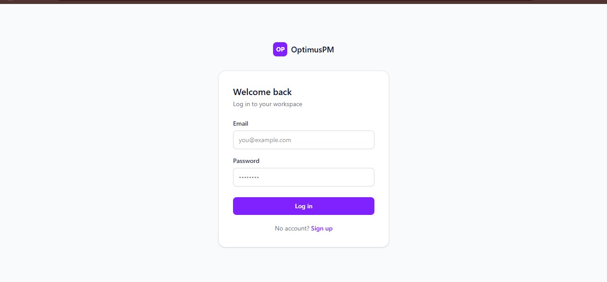
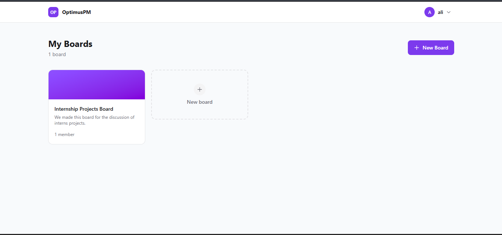
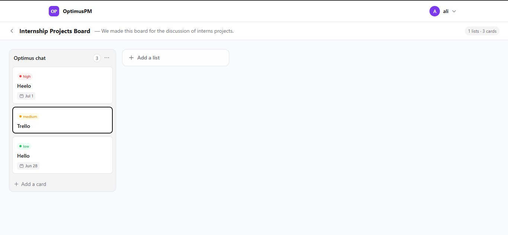
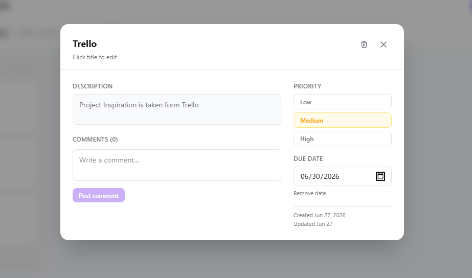

# OptimusPM


OptimusPM is a full-stack Kanban-style project management application inspired by tools like Trello. It enables users to organize projects using boards, lists, and task cards while supporting authentication, drag-and-drop task management, priorities, due dates, and comments.

The project follows a RESTful API architecture using the MERN stack and demonstrates secure authentication, state management, and scalable backend design.

**Live Demo:** https://optimus-automate-optimus-pm.vercel.app

**Backend API:** https://optimusautomateoptimuspm-production.up.railway.app/api/health

---

## Project Goal

The goal of OptimusPM was to build a modern Kanban-style project management application that demonstrates full-stack development skills including authentication, CRUD operations, drag-and-drop interactions, RESTful API design, and MongoDB data modeling.

---

## Features

### Authentication
- Register and Login with JWT
- Protected routes (private and public)
- Persistent sessions via localStorage

### Project Management
- Create, update, and delete boards
- Color-coded board banners
- Multi-member board support

### Task Management
- Create lists and cards within boards
- Set priority (Low / Medium / High) with color badges
- Set due dates — overdue dates turn red automatically
- Add descriptions to cards

### Collaboration
- Add and delete comments on cards
- Member avatars and initials display

### User Experience
- Drag and drop cards between lists and within lists
- Optimistic UI updates for instant feedback
- Fully responsive design
- Clean SaaS-style purple UI

---

## Tech Stack

### Frontend
| Technology | Purpose |
|------------|---------|
| React 18 | UI Framework |
| Vite 8 | Build Tool |
| Tailwind CSS v4 | Styling |
| Zustand | State Management |
| Axios | API Calls |
| React Router v6 | Routing |
| @dnd-kit | Drag and Drop |
| date-fns | Date Formatting |

### Backend
| Technology | Purpose |
|------------|---------|
| Node.js | Runtime |
| Express.js | Web Framework |
| MongoDB | Database |
| Mongoose | ODM |
| JWT | Authentication |
| bcryptjs | Password Hashing |
| express-validator | Input Validation |
| helmet + morgan | Security and Logging |

---

## Architecture

```
React + Zustand (Frontend State)
        |
     Axios (HTTP Client)
        |
 REST API (Express.js)
        |
 Controllers (Business Logic)
        |
  Mongoose Models (Data Layer)
        |
    MongoDB Atlas (Database)
```

### Backend Architecture (MVC)

```
Routes
  |
Controllers
  |
Models
  |
MongoDB
```

---

## Authentication Flow

- User registers or logs in
- Server validates credentials and checks the database
- JWT token is generated and returned
- Token is stored in localStorage on the client
- Axios automatically sends the token with every protected request
- Backend middleware verifies the token before allowing access to any route

---

## Drag and Drop

Cards can be moved between lists or reordered within the same list using @dnd-kit.

Whenever a card is dropped, the frontend immediately updates the UI and sends the new list and position to the backend. The backend persists these changes in MongoDB so the layout remains consistent after a page refresh.

---

## Database Design

### Models
- **User** — name, email, password (hashed), avatarUrl
- **Board** — title, description, owner, members[]
- **List** — title, board (ref), position
- **Card** — title, description, list (ref), board (ref), priority, dueDate, assignedTo, position
- **Comment** — content, card (ref), author (ref)

### Relationships
```
Board
 |-- Lists
 |    |-- Cards
 |         |-- Comments
 |-- Members (Users)
```

---

## Getting Started

### Prerequisites
- Node.js v18+
- MongoDB Atlas account
- Git

### Installation

**1. Clone the repo**
```bash
git clone https://github.com/TheHaqHub/OptimusAutomate_OptimusPM.git
cd OptimusAutomate_OptimusPM
```

**2. Backend Setup**
```bash
cd backend
npm install
```

Create `.env` in `/backend`:
```env
PORT=5002
NODE_ENV=development
MONGO_URI=your_mongodb_uri
JWT_SECRET=your_jwt_secret
JWT_EXPIRES_IN=7d
CLIENT_URL=http://localhost:5173
```

```bash
npm start
```

**3. Frontend Setup**
```bash
cd frontend
npm install
```

Create `.env` in `/frontend`:
```env
VITE_API_URL=http://localhost:5002/api
```

```bash
npm run dev
```

**4. Open** http://localhost:5173

---

## Project Structure

```
OptimusAutomate_OptimusPM/
|-- backend/
|   |-- config/          # Database connection
|   |-- controllers/     # Route handlers (MVC)
|   |-- middleware/      # Auth and error handling
|   |-- models/          # MongoDB schemas
|   |-- routes/          # API route definitions
|   |-- validators/      # Input validation rules
|   |-- utils/           # JWT helpers
|   |-- app.js           # Express app setup
|   |-- server.js        # Entry point
|
|-- frontend/
    |-- src/
        |-- api/         # Axios API layer (6 files)
        |-- components/  # Navbar, ListColumn, TaskCard, CardModal
        |-- pages/       # Login, Register, Boards, BoardDetail
        |-- store/       # Zustand stores (auth + board)
        |-- App.jsx      # Routes and guards
```

---

## API Endpoints

```
POST   /api/auth/register        Register user
POST   /api/auth/login           Login user
GET    /api/auth/me              Get current user

GET    /api/boards               Get all boards
POST   /api/boards               Create board
GET    /api/boards/:id           Get board with lists and cards
PUT    /api/boards/:id           Update board
DELETE /api/boards/:id           Delete board
POST   /api/boards/:id/members   Add member

POST   /api/lists                Create list
PUT    /api/lists/:id            Update list
DELETE /api/lists/:id            Delete list

POST   /api/cards                Create card
GET    /api/cards/:id            Get card details
PUT    /api/cards/:id            Update card
DELETE /api/cards/:id            Delete card
GET    /api/cards/:id/comments   Get comments
POST   /api/cards/:id/comments   Add comment
DELETE /api/comments/:id         Delete comment

GET    /api/users/search?q=      Search users
```

---

## Deployment

| Component | Service |
|-----------|---------|
| Frontend | Vercel |
| Backend | Railway |
| Database | MongoDB Atlas |

---

## Screenshots

### Login


### Boards


### Kanban Board


### Card Details


---

## Future Improvements

- Real-time collaboration using Socket.io
- Activity history and audit logs
- File attachments on cards
- Labels and tags system
- Search and filtering
- Email invitations for collaborators
- Board activity timeline

---

## What I Learned

Building OptimusPM strengthened my understanding of:

- RESTful API design with Express.js
- JWT Authentication and protected routes
- MVC Architecture on the backend
- MongoDB relationships and Mongoose ODM
- Drag-and-drop interfaces with @dnd-kit
- Global state management using Zustand
- Optimistic UI updates for better UX
- Full-stack deployment using Railway and Vercel
- CORS configuration for cross-origin requests

---

## License

This project is licensed under the MIT License.

---

## Acknowledgements

Inspired by modern Kanban tools such as Trello, Jira, and Linear.

---

## Author

Abdul Haq
Internship Project — OptimusAutomate
June 2026
